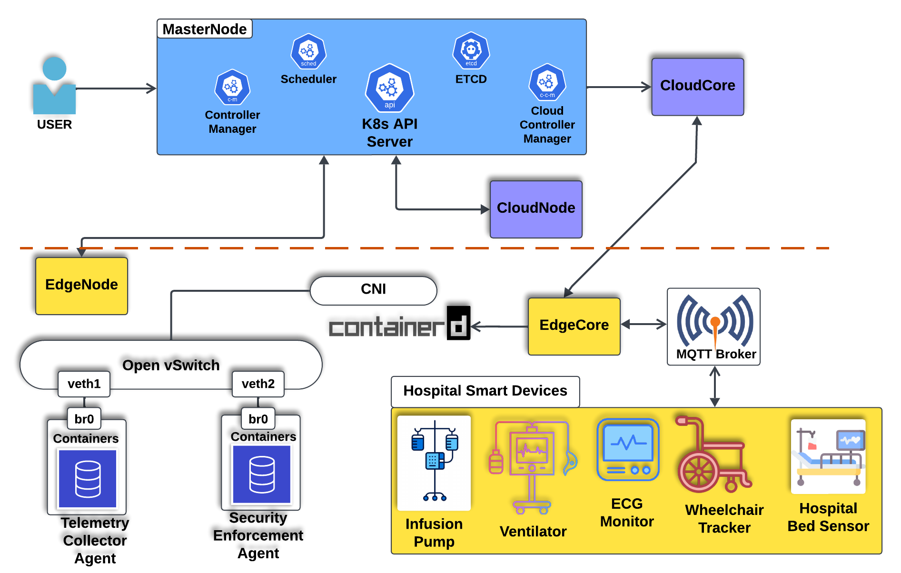

# SDN-Based Cloud-Edge Microservices Architecture for Smart Healthcare

This repository implements a Software-Defined Networking (SDN)-enabled, Kubernetes-based cloud-edge microservices architecture for **real-time hospital asset tracking, predictive maintenance**, and **dynamic security enforcement**.

The architecture integrates:

- **Microservices for telemetry analytics and policy management**
- **ONOS SDN controller** for flow rule orchestration
- **Open vSwitch (OVS)** at the edge node for fine-grained programmable networking
- **Kafka + MQTT** for streaming telemetry and security alerts
- **Prometheus + Grafana** for real-time metric monitoring
- **Flask-based Asset Monitoring Dashboard** with integrated flow logs

---



## 🚀 Architecture Overview

### Nodes
| Role        | Node Name     | Runtime    | CNI        | Description                             |
|-------------|---------------|------------|------------|-----------------------------------------|
| Master      | master-node   | containerd | Flannel    | Kubernetes control plane                |
| Cloud       | cloud-node    | containerd | Flannel    | Hosts ONOS + microservices              |
| Edge        | edge-node     | containerd | ❌ None    | Hosts virtual devices + OVS bridge      |

### Planes & Key Components

#### 🟩 Application Plane
| Service | Description |
|---------|-------------|
| `predictive-maintenance` | Autoencoder-based anomaly detection from telemetry |
| `policy-manager`         | REST-based flow policy updates to ONOS |
| `asset-monitoring-dashboard` | Web UI with alert and flow log visualization |

#### 🟦 Control Plane
| Component       | Description |
|------------------|-------------|
| `onos-controller` | ONOS SDN controller, listens on TCP 6653 |
| `fault-detector` | Triggers ONOS flow changes on failure detection |

#### 🔵 Data Plane
| Component         | Description |
|------------------|-------------|
| `virtual-devices` | Simulated ventilators, ECG monitors, infusion pumps, etc. |
| `telemetry-collector` | Subscribes to MQTT, streams data to Kafka |
| `openvswitch (OVS)` | Manages programmable flows on edge node |
| `security-enforcement-agent` | Blocks devices via ONOS or OVS + exposes Prometheus & UI API |

---

## 📦 Directory Structure

```bash
.
├── deployments/
│   ├── predictive_maintenance_deployment.yaml
│   ├── policy_manager_deployment.yaml
│   ├── asset_monitoring_dashboard_deployment.yaml
│   ├── onos_deployment.yaml
│   ├── fault_detector_deployment.yaml
│   ├── security_agent_daemonset.yaml
│   └── virtual-devices/ (ventilator, ecg, infusion...)
├── enforcement-agent/
│   ├── Dockerfile
│   ├── requirements.txt
│   └── enforcement_agent.py
├── dashboard/
│   ├── app.py
│   └── templates/index.html
└── README.md
```

---

## 🔧 Setup Instructions

### 1. Build and Push Images
```bash
docker build -t <your-dockerhub>/predictive-maintenance .
docker push <your-dockerhub>/predictive-maintenance
# Repeat for all other services
```

### 2. Deploy Microservices to Kubernetes
```bash
kubectl apply -f deployments/
```

### 3. Set Up OVS on Edge Node
```bash
sudo apt install -y openvswitch-switch
sudo ovs-vsctl add-br br0
sudo ovs-vsctl set-controller br0 tcp://<ONOS-IP>:6653
```

Manually connect pods to OVS using a veth pair (see `attach-pod-to-ovs.sh` for script).

---

## 📈 Monitoring & Visualization

### Prometheus Metrics (Port `9000`)
- `alerts_processed_total`
- `flows_blocked_total`
- `flow_log_scrapes_total`

### Asset Monitoring Dashboard (Port `5003`)
- `/api/alerts` — alert stream from predictive maintenance
- `/api/flows` — flow logs from Security Agent

---

## 📊 Grafana Integration

Prometheus scrapes Security Agent at:
```
http://security-agent-service:9000/metrics
```

Example Grafana panels:
- Blocked devices over time
- Security alerts per minute
- Flow logs heatmap (via `/api/flows`)

---

## 📚 Related Work

This architecture was implemented as part of the research presented in:
- IEEE MeMeA 2025 (submitted): *“A Cloud-Edge Microservices Architecture for Smart Healthcare: SDN-Based Medical Asset Management”*

---

## ✨ Highlights

- 94.5% anomaly detection accuracy using Autoencoder models
- Inference latency of 35.2ms for real-time medical telemetry
- Edge node offloads 35% of cloud processing via KubeEdge
- Fully programmable traffic flow using ONOS + OVS

---